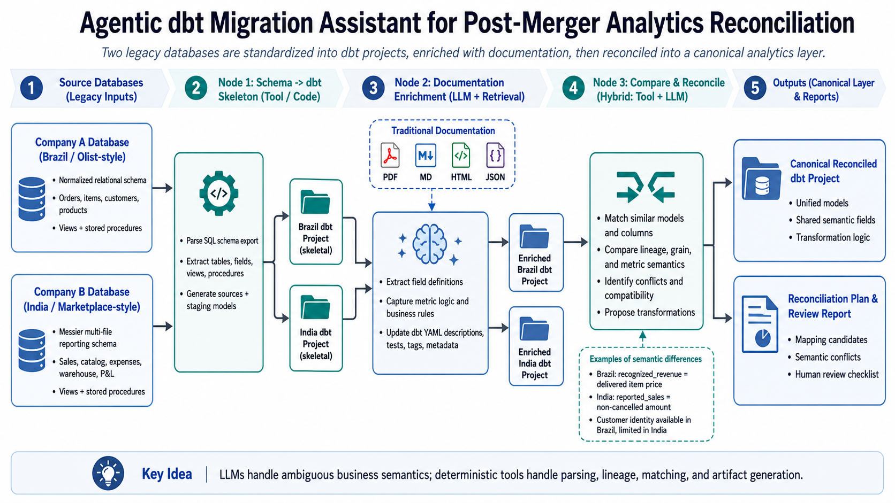

### A Real Analytics Engineering Problem

One of the hardest problems in analytics engineering is not building a clean warehouse from scratch. It is inheriting multiple systems that were never designed to work together, then making them understandable enough to support unified reporting.

That problem becomes especially painful during mergers and acquisitions.

After a merger, a company often has to reconcile two independently evolved databases, each with its own:

- schemas
- naming conventions
- views and reporting tables
- stored procedures
- business definitions
- documentation quality

At that point, even basic questions become expensive:

1. Which tables are actually talking about the same business concept?
2. Are these fields equivalent or only superficially similar?
3. Are revenue metrics comparable, or do they encode different business rules?
4. Which pieces of the legacy reporting logic are safe to migrate into a shared analytics layer?

That is the problem this project is trying to solve.

This portfolio project is an **agentic dbt migration assistant for post-merger analytics reconciliation**. It is designed to take two legacy-style relational systems, translate them into interpretable dbt projects, enrich them with semantic information from documentation, compare them at the entity and metric level, and generate a reconciliation plan for a shared canonical analytics layer.

The point is not to create a magical autonomous migration engine. The point is to create a system that can accelerate the most time-consuming parts of merger analytics integration while preserving the places where human review is still necessary.

You can find the codebase on my [GitHub page](https://github.com/austinwindsor/post_merger_dbt_agent_setup).

### Project Goal

The project goal is straightforward:

**turn two messy legacy databases into structured, documented, comparable analytics artifacts, then use those artifacts to propose a reconciled dbt-oriented target model.**

To make the problem concrete, I simulated two source systems:

1. a more normalized Brazil-based e-commerce database
2. a messier India-based marketplace reporting environment built from sales, expense, warehouse, and P&L extracts

Both contain overlapping business concepts, but they do not define those concepts in the same way.

For example:

- Brazil defines recognized revenue around delivered orders
- India defines reported sales around non-cancelled positive sales lines
- Brazil exposes a clear GMV concept
- India does not expose a clearly equivalent GMV metric
- Brazil supports a customer identity model
- India, in this simulated reporting layer, does not

That means the real challenge is not just translating SQL into dbt. It is identifying where the systems align, where they diverge, and what can be safely mapped into a shared reporting layer.

### Breaking the Problem into Parts

To make the problem tractable, I broke it into four parts.

#### 1. Structural translation

The first step is purely structural:

- parse MySQL schema dumps
- identify tables, fields, views, and stored procedures
- generate source-specific dbt starter projects
- preserve lineage-related artifacts such as view SQL and procedure references

This part is largely deterministic. If the input is a schema dump, the system can reliably extract the database objects and produce a dbt-compatible structure around them.

#### 2. Semantic enrichment

The second step is where things stop being fully deterministic.

Enterprise documentation rarely arrives in a neat machine-readable format. It is usually prose with mixed quality, partial definitions, business caveats, and embedded assumptions. It may describe fields, but not consistently. It may describe views and reporting tables at a high level while leaving important transformations implicit.

That means the system needs a way to convert documentation into structured semantic evidence, including:

- business definitions
- grain
- join keys
- field meanings
- metric logic
- caveats
- evidence excerpts

This is where deterministic logic alone becomes brittle.

#### 3. Cross-project comparison

Once each source system has both structural and semantic artifacts, the next step is to compare them:

- object to object
- field to field
- metric to metric
- grain to grain
- caveat to caveat

The goal is to generate:

- mapping candidates
- semantic conflicts
- reconciliation plans

This step can be partly deterministic and partly judgment-driven, depending on how close or ambiguous the mappings are.

#### 4. Orchestration and review

Finally, the system needs to coordinate:

- deterministic file generation
- LLM-based semantic extraction
- validation
- reconciliation outputs
- human review when confidence is low

That is an orchestration problem, not just a parsing problem.

### Constraints That Shaped the Design

A useful migration assistant for merger analytics needs to respect a few real-world constraints.

#### Constraint 1: Not everything should be agentic

Some parts of the workflow are fully deterministic:

- parsing tables and columns
- generating dbt folders and models
- writing source YAML
- exporting inventories
- serializing metadata artifacts

Using an LLM or agent loop for these steps would add complexity without adding value.

#### Constraint 2: Not everything can be deterministic

Other parts of the workflow are inherently less stable:

- mapping prose documentation into structured field semantics
- resolving ambiguous business definitions
- deciding whether two revenue metrics are directly comparable
- interpreting legacy reporting intent

These are exactly the places where limited agentic reasoning can help.

#### Constraint 3: Human review still matters

Merger reconciliation is not just a technical exercise. It is also a governance exercise.

A system can identify that two concepts look related. It can identify where definitions differ. It can propose a mapping policy. But it should not silently decide that two metrics are equivalent when the business meaning is materially different.

That means the workflow needs to preserve:

- evidence
- caveats
- confidence
- review flags

### Choosing Tools Based on the Problem

The tools in this project were chosen to match the structure of the problem.

#### dbt as the target analytics layer

dbt is a strong target representation for legacy analytics migration because it gives structure to:

- sources
- staging models
- legacy-translated views
- model metadata
- lineage
- tests
- documentation

Even when the source system never used dbt, converting it into a dbt-like structure makes it much easier to inspect and compare.

#### Deterministic Python modules for the structural layer

The structural steps are handled by Python:

- parsing schema dumps
- extracting views and procedures
- generating dbt starter projects
- exporting inventory and lineage artifacts
- validating semantic evidence
- comparing project semantics
- generating reconciliation artifacts

Those steps benefit from being reliable, testable, and repeatable.

#### OpenAI models for the semantic extraction layer

The most important non-deterministic problem in the workflow is documentation interpretation.

A real client database may have documentation that describes:

- raw tables
- field meanings
- reporting rules
- operational caveats
- metric intent

But those descriptions are often embedded in prose, headings, bullet lists, or half-structured notes. That makes semantic extraction a good LLM use case, especially when the output is constrained to a structured schema and validated afterwards.

The LLM is not being asked to build the whole system. It is being asked to perform a limited job:

**turn messy business documentation into structured semantic evidence that deterministic code can validate and apply.**

#### LangGraph for orchestration

Given the step-like nature of the workflow and the limited but important use of an LLM, LangGraph was a good orchestration choice.

The system has:

- multiple ordered steps
- deterministic nodes
- LLM-backed nodes
- validation boundaries
- points where human review may be needed

That is a better fit for graph orchestration than for a single free-form agent loop.

In other words, LangGraph is not there because the project needed an “agent” for marketing reasons. It is there because the workflow contains a mixture of deterministic and non-deterministic steps that need to be coordinated cleanly.

### What the Workflow Does

At a high level, the workflow:

1. parses each MySQL dump
2. generates a dbt starter project for each source
3. extracts or accepts semantic evidence from documentation
4. enriches `sources.yml`, staging model YAML, and legacy view YAML
5. exports normalized project semantics
6. compares the two projects
7. emits mapping candidates, semantic conflicts, and a reconciliation plan

The output is not just code. It is a set of human-reviewable artifacts that make the source systems easier to reason about.

### Why This Would Be Useful in a Real Merger

In a real merger setting, the value of this system is speed and structure.

#### Benefit 1: Faster discovery of related tables and reporting objects

Large enterprise databases often contain hundreds of tables, views, and reporting artifacts. A migration assistant that converts those into structured dbt and metadata artifacts can drastically reduce the time it takes to find:

- raw tables with overlapping business roles
- legacy views that define important metrics
- reporting tables populated by procedures
- objects that need deeper review

#### Benefit 2: Better semantic visibility

Most integration pain is semantic, not syntactic.

Two fields may both be called “amount,” but one may mean delivered revenue and the other may mean gross reported sales. By pulling business semantics into structured evidence, the system makes those distinctions visible much earlier.

#### Benefit 3: A more reviewable migration path

Instead of jumping directly from source systems to a canonical model, the workflow creates intermediate artifacts that can be inspected:

- source-specific dbt projects
- semantic evidence
- mapping candidates
- conflict files
- reconciliation plans

That makes the migration process easier to audit and easier to discuss with stakeholders.

#### Benefit 4: Stronger handoff between engineering and business review

The workflow does not just generate technical outputs. It creates a better interface between:

- analytics engineers
- data platform teams
- governance leads
- business stakeholders

because it can surface not only “what maps,” but also “what does not map cleanly and why.”

### Pros of This Approach

There are several reasons I think this approach is useful.

#### Pro 1: It respects the boundary between deterministic and non-deterministic work

The workflow does not waste LLM calls on tasks that code can do reliably. Instead, it uses LLM reasoning where the input is ambiguous and the output needs interpretation.

#### Pro 2: It creates useful artifacts even before full reconciliation

Even if the final canonical layer is not yet approved, the generated dbt projects, lineage files, and semantic evidence are already useful for documentation, discovery, and migration planning.

#### Pro 3: It encourages explicit treatment of metric differences

One of the strongest parts of the workflow is that it does not collapse all similar-looking metrics into one bucket. It forces a distinction between:

- direct matches
- transformable matches
- partial matches
- unresolved conflicts

That is much healthier than quietly flattening differences away.

#### Pro 4: It scales better than manual schema review alone

For large databases, manual schema comparison is expensive. This kind of system can narrow the search space and highlight the parts worth human attention.

### Cons and Limitations

This is not a magic system, and it has real limitations.

#### Con 1: Documentation remains a limiting factor

The deterministic MySQL-to-dbt mapping is relatively reliable. The semantic enrichment layer is not equally reliable, because it depends on an LLM extracting meaning from enterprise documentation.

If the documentation is poor, inconsistent, or incomplete, the enrichment output will be weaker. The workflow can structure ambiguity, but it cannot eliminate it.

#### Con 2: LLM extraction is sensitive to object naming and prompt quality

Even with validation and normalization, documentation extraction can still produce:

- incomplete object coverage
- slightly wrong object mappings
- weak field-level semantics
- partial or noisy evidence

That means a production-grade version would need stronger prompt tuning, stricter structured output, better evaluation, and fallback review paths.

#### Con 3: Stored procedures remain difficult

Views are often manageable. Stored procedures are much more variable. They can contain control flow, temp tables, update logic, and side effects that do not map neatly into dbt or into a purely structural lineage representation.

That is why a conservative treatment of procedures remains important.

#### Con 4: Reconciliation still contains governance decisions

The system can help identify likely equivalences and differences. But deciding whether two partially aligned metrics should become one enterprise KPI is often a policy decision, not just a data engineering one.

### What This Project Demonstrates

For me, the most interesting part of this project is that it demonstrates a practical model for using AI in analytics engineering.

The system is not “AI-first” in the sense of replacing every step with model calls. It is “AI-appropriate” in the sense of:

- using deterministic tooling for reliable translation and validation
- using LLM reasoning where the task is semantically ambiguous
- preserving artifacts for human review
- making tradeoffs explicit

That feels much closer to how real enterprise data systems should incorporate agentic workflows.

### Final Thoughts

Post-merger analytics reconciliation is one of those problems that looks deceptively simple until you get close to the source systems.

On paper, it sounds like a mapping exercise. In practice, it is:

- a metadata problem
- a documentation problem
- a lineage problem
- a semantic modeling problem
- and sometimes a governance problem

That is why I found this project so compelling.

A useful migration assistant does not need to solve all ambiguity automatically. It needs to reduce the cost of understanding legacy systems, speed up the identification of related entities and metrics, and surface the assumptions that need human judgment.

That is the role I wanted this project to fill.

The result is a system that uses:

- deterministic MySQL-to-dbt translation where the problem is structural
- LLM-based semantic extraction where the problem is interpretive
- graph orchestration where the workflow needs state, order, and review

For analytics engineering, data platform, semantic layer, governance, and AI-ready enterprise data roles, I think that is a more realistic and more useful model than treating agentic systems as a blanket solution.
